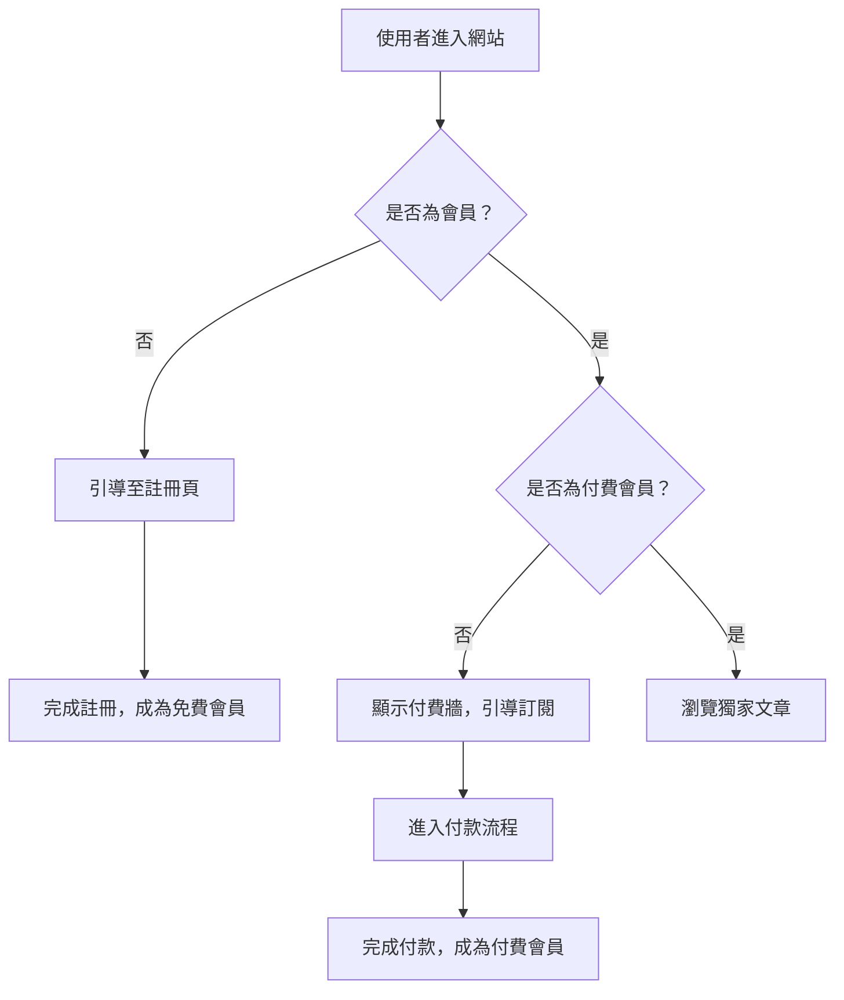

# 第二課：PM 的 AI 超能力，用 Vibe Coding 串連工作流

歡迎來到 AI Vibe Coding 系列的第二堂課。在上一課，我們體驗了如何從零開始，用與 AI 對話的方式快速建立一個網站。今天，我們將把這個概念提升到一個新的層次，探討身為產品經理 (PM)，該如何利用 AI 工具鏈，將繁瑣的工作流程自動化，釋放出真正的「超能力」。

## PM 的痛點：在工具之間疲於奔命

一個典型的產品開發流程，PM 可能需要：
1.  用 **MindNode** 或 **XMind** 繪製心智圖，發想功能。
2.  用 **Mermaid** 或 **PlantUML** 畫出使用者流程圖 (User Flow)。
3.  用 **Figma** 製作簡單的線框圖 (Wireframe)。
4.  打開 **Google Docs** 或 **Notion** 撰寫產品需求文件 (PRD)。
5.  最後，用 **Gamma** 或 **PowerPoint** 製作一份給老闆或團隊的簡報。

每一個步驟都意味著一次工具的切換、一次內容的複製貼上，以及一次格式的重新調整。這個過程不僅耗時，也容易出錯。

## Vibe Coding 如何解決這個問題？

Vibe Coding 的核心是「以終為始」，我們直接告訴 AI 我們最終想要的產出，然後讓它來串連所有工具與流程。在這個情境下，我們不再是工具的使用者，而是工作流的「設計師」。

我們的 AI 工具鏈：
- **ChatGPT / Gemini**: 我們的大腦，負責生成所有文字內容與程式碼。
- **Mermaid**: 一個用文字語法來產生圖表的工具，是我們與 AI 溝通流程圖的共同語言。
- **Gamma**: 一個能將文字快速轉化為精美簡報的 AI 工具。
- **Gemini CLI**: 我們在終端機中的執行者，負責串起所有任務。

## 實戰演練：一鍵產生產品規劃

假設我們要為我們的部落格網站規劃一個「會員訂閱」功能。傳統流程可能要花半天，現在我們試試 Vibe Coding。

### 步驟 1: 定義你的「Vibe」

首先，我們用一段清晰的自然語言，描述我們想要的功能與產出。

> 「我正在規劃一個部落格的會員訂閱功能。使用者可以免費註冊，付費後可以閱讀獨家文章。請幫我完成以下任務：
> 1.  產生這個功能的心智圖 (用 Mermaid 的 mindmap 語法)。
> 2.  根據心智圖，產生使用者從註冊到付費的流程圖 (用 Mermaid 的 flowchart 語法)。
> 3.  撰寫一份包含功能列表、使用者故事和規格的 PRD (Markdown 格式)。
> 4.  最後，幫我產生一份給團隊看的 Gamma 簡報大綱。」

### 步驟 2: 讓 AI 執行

我們可以將這段提示貼給 ChatGPT 或 Gemini，它會一次性生成所有我們需要的文字產出，包含 Mermaid 語法、Markdown PRD 和簡報大綱。

**產出範例 (Mermaid 流程圖):**

### 步驟 3: 整合與呈現

拿到這些產出後，你只需要：
- 將 Mermaid 語法貼到任何支援 Mermaid 的編輯器 (如 VS Code 擴充功能、Notion) 即可看到視覺化的圖表。
- 將 Markdown PRD 稍作整理，一份專業的需求文件就完成了。
- 將 Gamma 大綱貼到 Gamma，一鍵生成精美的簡報。

整個過程不到 10 分鐘，你就完成了過去需要數小時才能完成的工作。

## 結論：PM 的新價值

在 AI 時代，PM 的價值不再是「畫圖」和「寫文件」，而是「提出好問題」和「設計好系統」。透過 Vibe Coding，你可以將瑣碎的執行工作交給 AI，讓自己專注於更具策略性的任務：市場分析、使用者研究、以及產品願景的規劃。

這就是 PM 的 AI 超能力。現在就開始打造你自己的 AI 工作流吧！